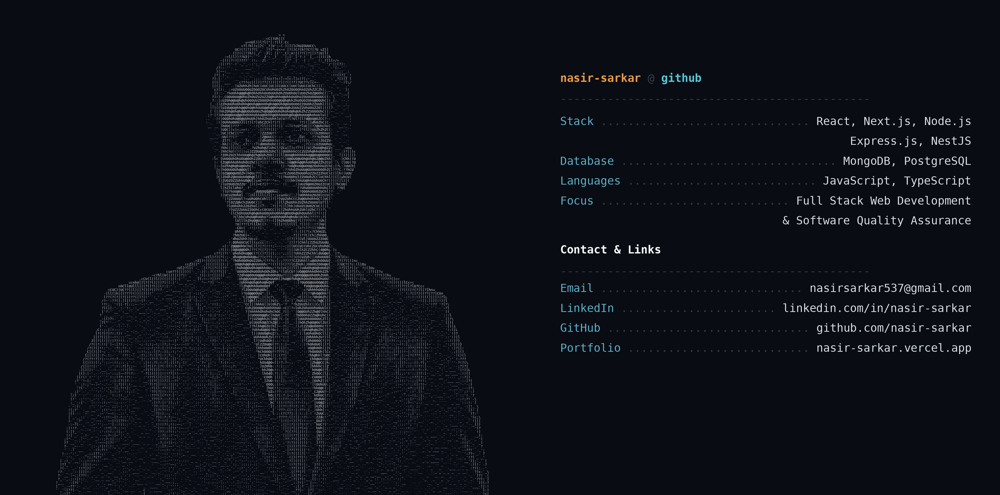

  

###

  

###

# Hi, I am Nasir Sarkar👋 
I am a Computer Science and Engineering graduate from American International University Bangladesh with experience building full stack web applications using React, Node.js, Express.js, MongoDB, JavaScript, TypeScript, and Tailwind CSS. I completed my internship as a Full Stack Web Developer at PAP International Ltd., where I gained real-world experience. Alongside my interest in research, I am now expanding into Software Quality Assurance, building a strong foundation in manual testing and automation, while my development background helps me identify issues before software is released.

###

<h2 align="left">Top Skills</h2>

###

  
  
  
  
  
  
  
  
  
  
  
  
  
  
  
  
  

###

<h2 align="left">Contact</h2>

###

  <a href="mailto:Nasir%20Sarkar%20<nasirsarkar537@gmail.com>" target="_blank">
    
  </a>
  

###

<h2 align="left">Contribution</h2>

###

  

  

